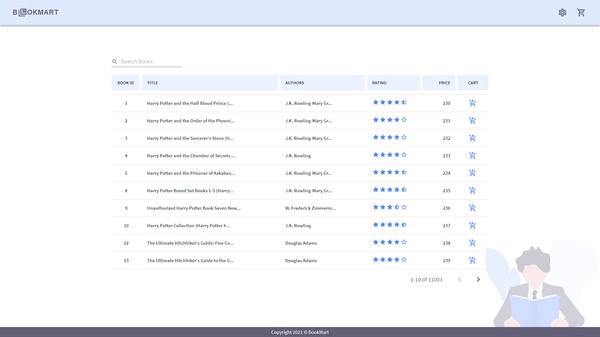
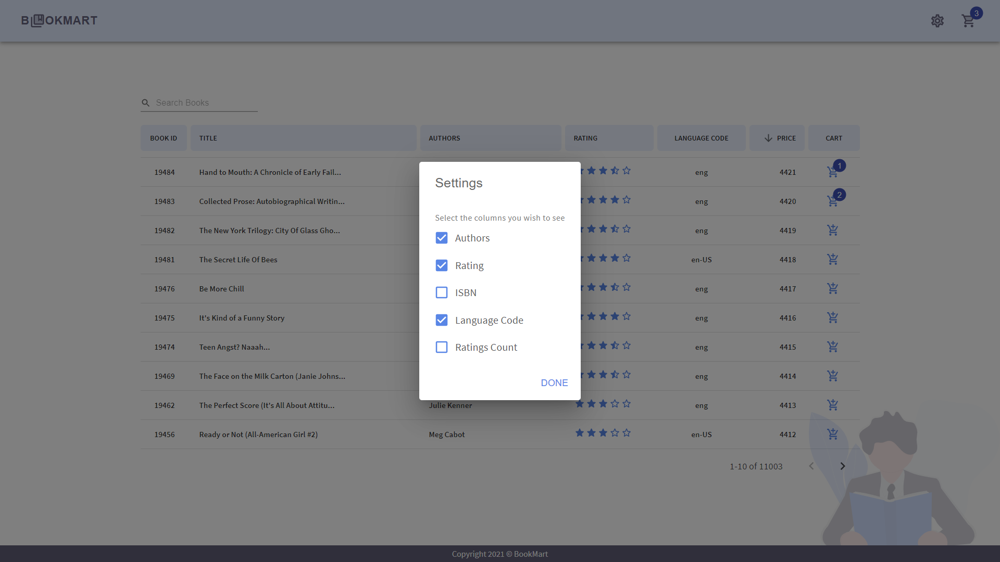
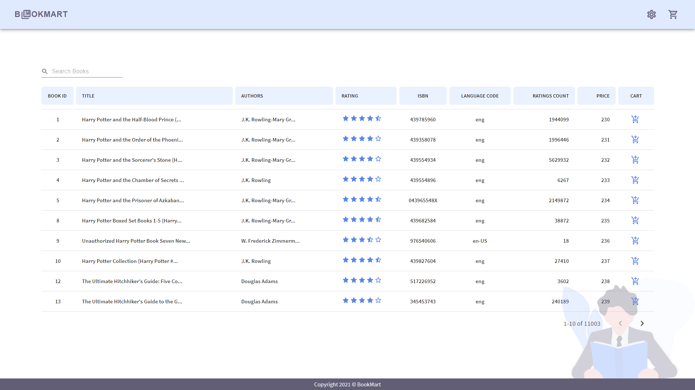
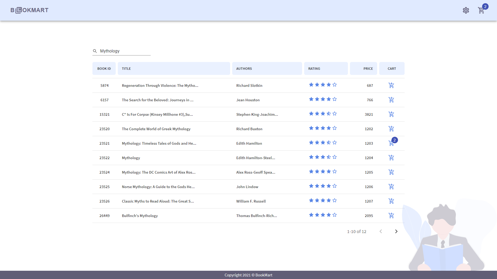
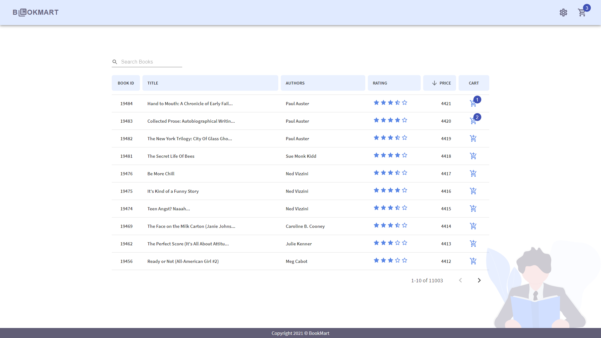
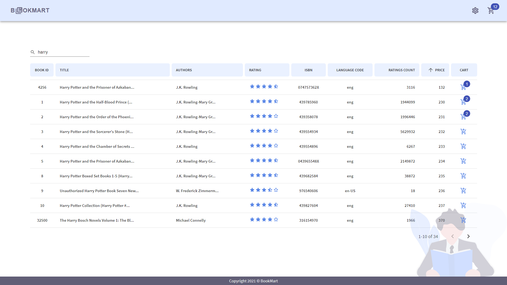
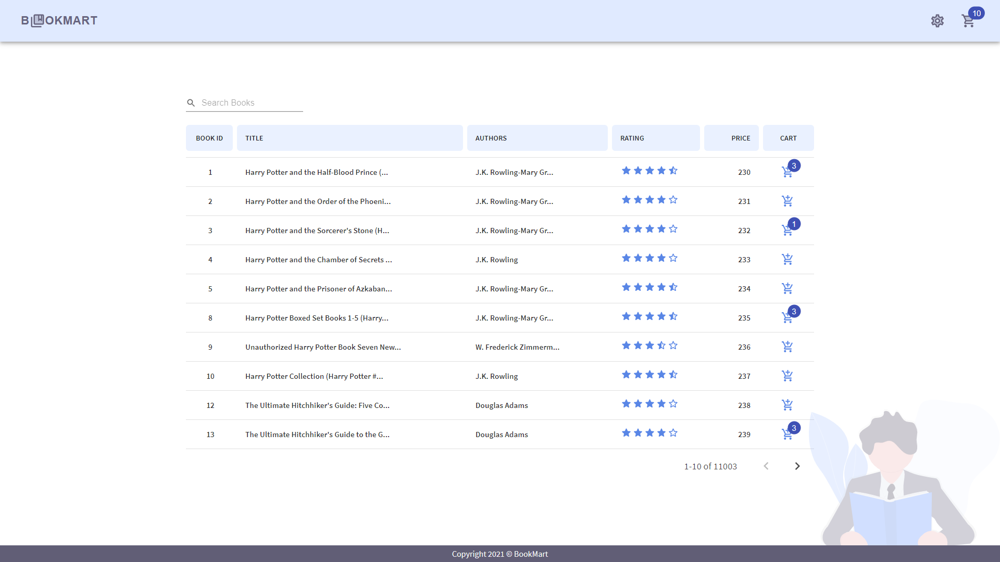
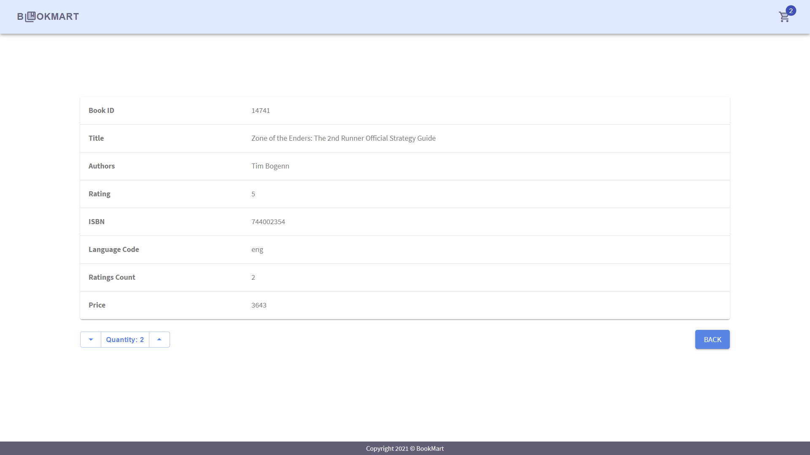
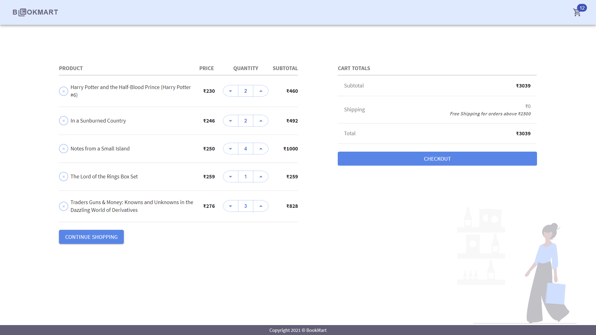
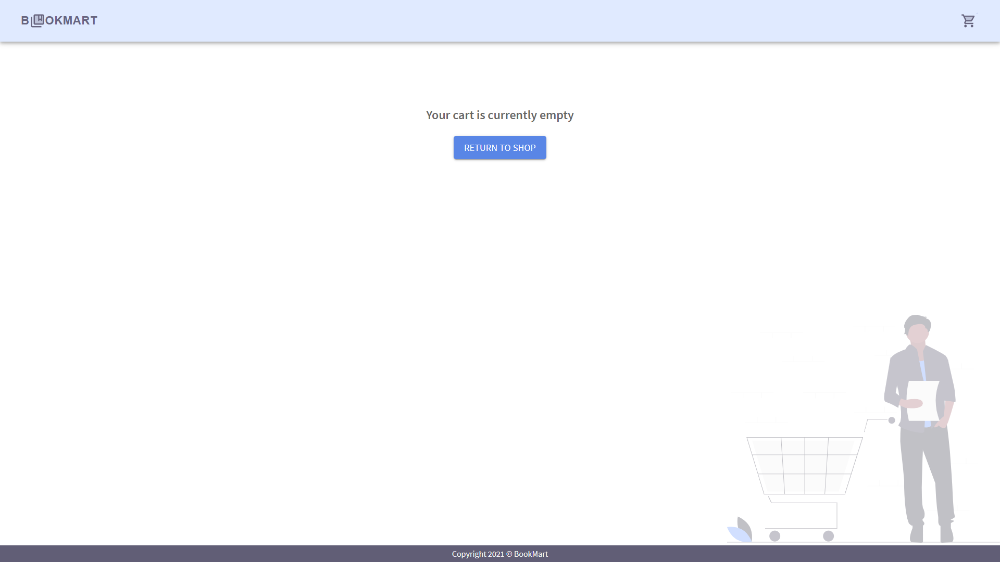

## Instructions

> Running Locally

**NOTE:** You need "npm" installed on your computer to view this project

In the project directory _(BookMart)_, run:

##### `npm install`

And then run:

##### `npm start`

Runs the app in the development mode.\
Open [http://localhost:3000](http://localhost:3000) to view it in the browser.

> Github

Github Link: https://github.com/ssmkhrj/BookMart

Hosted Link: https://bookmart.netlify.app/

## Screenshots with description

By default 5 columns (BookID, Title, Authors, Rating, Price) are shown.

Users can also manually select other columns by clicking on the settings button on the navbar and checking the columns that they want to see.

_NOTE: Columns like BookID, Title, Price cannot be unselected so they are not present in the settings menu._

Image showing table with all columns selected.

Users can search for their favourite books using the search bar.
Image below shows a search of all “Mythology” books.

Users can sort the books by their Rating, Price, Number of ratings and Author’s name (in both ascending and descending order).

Users can search for some keyword and then sort only the filtered results.
Image below shows all the books containing the term “harry” sorted by their “price”.

Users can add their favourite books to the cart by clicking on the cart button on the corresponding row.

Users can navigate to the cart page by clicking on the cart button present on the navbar.

Badge over the cart button displays the quantity of the corresponding item present in the cart.

And the badge over the cart button on the navbar displays the total no. of items present in the cart.

To keep the table layout consistent the content of columns “title” and “authors” get stripped after a certain length. So, to get the full description of the book the user can navigate to the particular book page (by clicking on that book row).

The cart page lists all the items in the cart along with their quantities.

Users can change the quantity for a particular item by using the increment decrement buttons. If the quantity is dropped to zero the item disappears from the cart.

Users can also remove items from the cart by clicking on the cross button.

When the cart is empty the user gets a message saying that the cart is empty.

